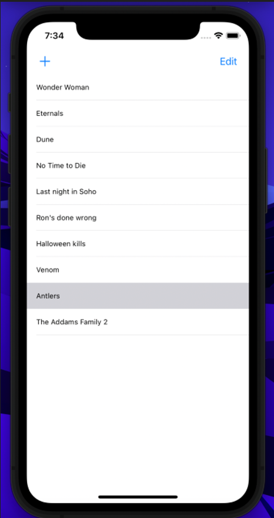

# ISP1002_MovieTodoList

You can find the code [here](https://github.com/balajic19/ISP1002_MovieTodoList.git) to clone.

- Student 1:  
  Name: Balaji Chandupatla  
  Student Number: A00245077  

- Student 2:  
  Name: Prathyusha Peddireddy
  Student Number: A00245208

- Student 3:  
  Name: Shiva Rama Krishna
  Student Number: A00245380  

## Lab Description:  
- Build a basic Movie Todo List
- The UI looks as below

<!--  -->
